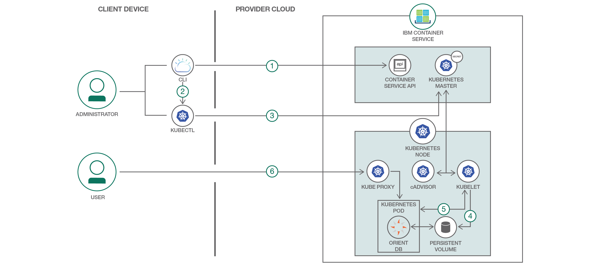
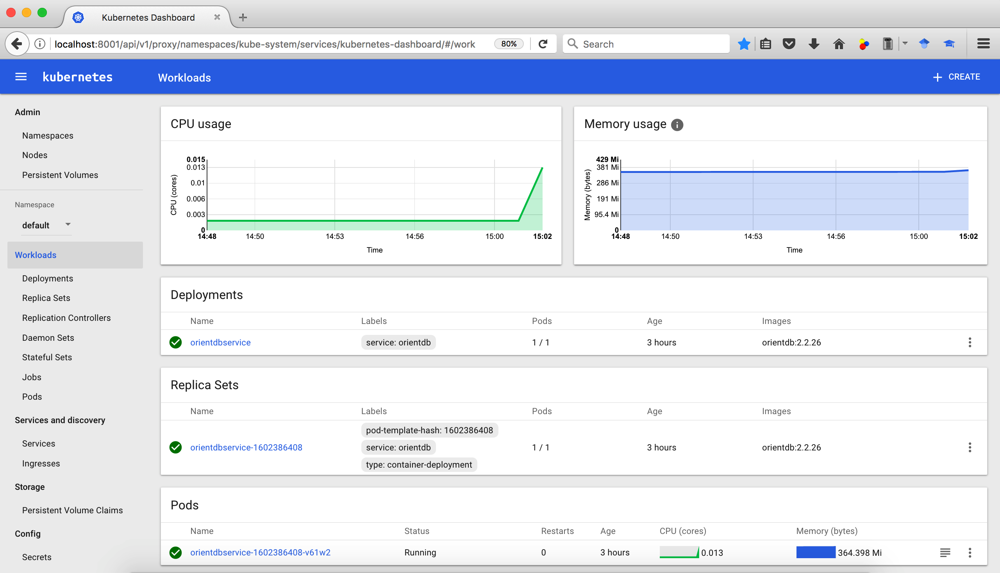
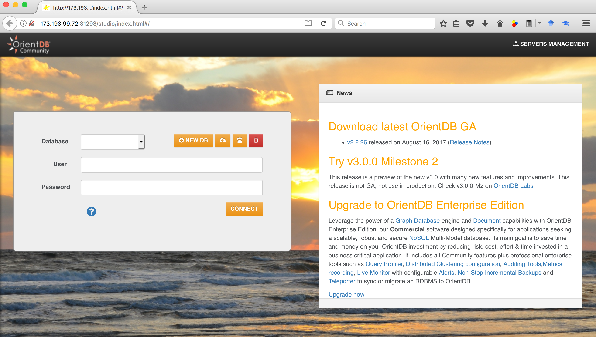
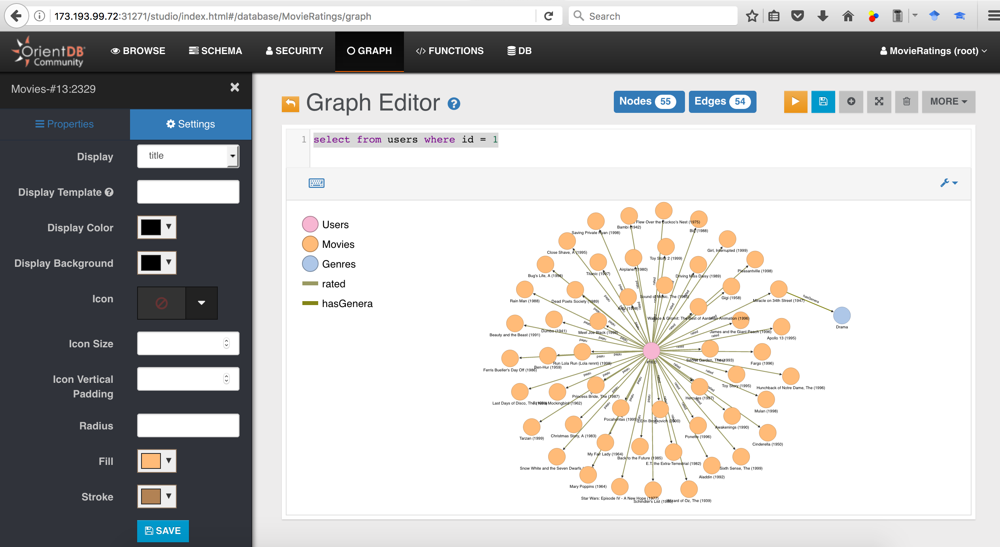

# Bluemix 쿠버네티스에 OrientDB 컨테이너 배포하기

*다른 언어로 보기: [English](README.md).*

[OrientDB](https://github.com/orientechnologies/orientdb)와 같은 [그래프(Graph) 데이터베이스](https://en.wikipedia.org/wiki/Graph_database)는 노드(node), 엣지(edge) 그리고 속성(property)으로 구성된 그래프 구조 자료를 저장합니다. 디자인적으로 그래프 데이터베이스는 복잡하고 계층적 자료 구조를 관계형 데이터베이스보다 더 효율적인 방식으로 단순하고 빠르게 가져옵니다. [Gremlin](http://tinkerpop.apache.org/gremlin.html)은 그래프 데이터베이스에서 데이터를 가져오기 위해 표준화된 그래프 순회(traverse) 언어입니다 (RDBMS에서 SQL과 같은 방식).

이 과정에서는 Bluemix 컨테이너 서비스에 OrientDB를 배포하는 방법을 보여주어 이를 개발이나 테스트 목적으로 활용할 수 있도록 합니다.

[IBM Bluemix 컨테이너 서비스](https://console.bluemix.net/docs/containers/cs_ov.html#cs_ov)는 [도커(Docker)](https://docs.docker.com/get-started/)와 [쿠버네티스(Kubernetes)](https://kubernetes.io/docs/concepts/overview/what-is-kubernetes/)가 조합된 형태로서 쿠버네티스 API를 사용하여 독립 컴퓨트 호스트로 구성된 클러스터에서 컨테이너화된 애플리케이션의 자동화된 배포, 운영, 확장 및 모니터링이 가능한 강력한 도구를 제공합니다.

이 과정은 다음과 같은 단계를 제공합니다:
* Bluemix 쿠버네티스에 OrientDB 컨테이너 배포
* 쿠버네티스 secret에 OrietntDB의 비밀번호 저장
* 쿠버네티스 volume claim을 사용하여 OrientDB volume용 영구 저장소 구성
* 실행중인 컨테이너의 쉘(shell)에 접근하는 쿠버네티스 기능을 이용한 Gremlin 콘솔을 비롯한 배포된 OrientDB의 콘솔에 접속

# 순서



1. Bluemix CLI로 로그인 후 Bluemix 컨테이너 서비스 플러그인을 초기화 합니다.
2. Bluemix 쿠버네티스 설정 파일을 다운로드하고 KUBECONFIG 환경 변수를 설정하여 쿠버네티스 CLI에 대한 컨텍스트를 지정합니다.
3. 쿠버네티스 secret에 OrientDB에 대한 비밀번호를 저장합니다.
4. OrientDB volume용 영구 저장소를 구성합니다.
5. OrientDB 컨테이너와 쿠버네티스 클러스터에 대한 NodePort 서비스를 배포합니다.
6. Worker 노드의 퍼블릭 IP 주소와 NodePort에 매핑된 OrientDB의 HTTP 포트를 이용하여 OrientDB 대시보드에 접근합니다.

## 둘러보기 영상

[](https://youtu.be/bG3xynJs0T8)

## 쿠버네티스 개념
* [Kubernetes Pod](https://kubernetes.io/docs/concepts/workloads/pods/pod/) - pod는 쿠버네티스 클러스터에 배포되는 가장 작은 단위를 나타내며, 단일 단위로 처리되어야만 하는 컨테이너들을 무리 짓는 용도로 사용됩니다.
* [Kubernetes Deployment](https://kubernetes.io/docs/concepts/workloads/controllers/deployment/) - deployment는 쿠버네티스 리소스 중 하나로서, 해당 컨테이너와 영구 저장소 서비스나 Annotation과 같은 애플리케이션 실행에 필요한 다른 리소스를 지정합니다.
* [Kubernetes Service](https://kubernetes.io/docs/concepts/services-networking/service/) - 쿠버네티스 service는 pod들을 그룹화하며, 클러스터에 있는 다른 service들에게 pod의 프라이빗 IP를 노출하지 않는 네트워크 연결을 제공합니다.
* [Kubernetes Persistent Volumes (PV)](https://kubernetes.io/docs/concepts/storage/persistent-volumes/) - PersistentVolumes는 사용자들에게 NFS 파일 저장소와 같은 내구성 있는 저장소를 *요청* 하는 방식입니다.
* [Kubernetes Secret](https://kubernetes.io/docs/concepts/configuration/secret/) - *secret* 타입의 오브젝트는 비밀번호나 OAuth 토큰이나 ssh 키와 같은 민감한 정보를 저장합니다.

## 포함된 구성 요소
* [Bluemix 컨테이너 서비스](https://console.ng.bluemix.net/docs/containers/cs_ov.html#cs_ov) IBM Bluemix 컨테이너 서비스는 IBM Cloud에서 실행되는 Docker 컨테이너와 쿠버네티스 클러스터 내부에서 고가용성 애플리케이션을 관리합니다.
<!-- * [Bluemix 쿠버네티스 클러스터](https://console.ng.bluemix.net/catalog/?taxonomyNavigation=apps&category=containers) - 쿠버네티스 클러스터는 컨테이너화 된 애플리케이션을 배포하고 실행하고 관리할 수 있는 하나 이상의 가상 머신(worker 노드라 불림)으로 구성되어 있습니다.
* [Bluemix DevOps 툴체인 서비스](https://console.ng.bluemix.net/catalog/services/continuous-delivery) - Bluemix DevOps 툴체인 서비스는 애플리케이션의 빌드 및 배포를 자동화 합니다. -->
* [OrientDB](https://github.com/orientechnologies/orientdb) - OrientDB는 네이티브 그래프(Native Graph)를 지원하는 오픈 소스 다중-모델 NoSQL DBMS입니다.

## 단계
1. [Bluemix 쿠버네티스 클러스터 구성하기](#단계-1-bluemix-쿠버네티스-클러스터-구성하기)
  - 1.1 [Bluemix와 쿠버네티스용 CLI 설치하기](#11-bluemix와-쿠버네티스용-cli-설치하기)
  - 1.2 [Bluemix CLI로 로그인 후 Bluemix 컨테이너 서비스 플러그인 초기화하기](#12-bluemix-cli로-로그인-후-bluemix-컨테이너-서비스-플러그인-초기화하기)
  - 1.3 [Bluemix 쿠버네티스 클러스터 생성하기](#13-bluemix-쿠버네티스-클러스터-생성하기)
  - 1.4 [쿠버네티스 CLI로 Bluemix 쿠버네티스 클러스터 지정하기](#14-쿠버네티스-cli로-bluemix-쿠버네티스-클러스터-지정하기)
2. [쿠버네티스 클러스터에 OrientDB 서비스 배포하기](#단계-2-쿠버네티스-클러스터에-orientdb-서비스-배포하기)
  - 2.1 [OrientDB 쿠버네티스 구성 스크립트 복사하기](#21-orientdb-쿠버네티스-구성-스크립트-복사하기)
  - 2.2 [쿠버네티스 secret에 OrientDB 비밀번호 저장하기](#22-쿠버네티스-secret에-orientdb-비밀번호-저장하기)
  - 2.3 [OrientDB volume용 영구 저장소 구성하기](#23-orientdb-volume용-영구-저장소-구성하기)
  - 2.4 [쿠버네티스 클러스터에 OrientDB 배포하기](#24-쿠버네티스-클러스터에-orientdb-배포하기)
  - 2.5 [로컬 버젼 쿠버네티스 대시보드 보기](#25-로컬-버젼-쿠버네티스-대시보드-보기)
  - 2.6 [OrientDB 대시보드 보기](#26-orientdb-대시보드-보기)
3. [공공 데이터베이스를 추가하고 OrientDB 대시보드와 Gremlin 콘솔에서 확인하기](#단계-3-공공-데이터베이스를-추가하고-orientdb-대시보드와-gremlin-콘솔에서-확인하기)
  - 3.1 [공공 데이터베이스 추가하기](#31-공공-데이터베이스-추가하기)
  - 3.2 [OrientDB 대시보드를 이용하여 스키마 및 데이터 (vertices/edges) 확인하기](#32-orientdb-대시보드를-이용하여-스키마-및-데이터-verticesedges-확인하기)
  - 3.3 [Gremlin/OrientDB 콘솔을 열어 쿼리 실행하기](#33-gremlinorientdb-콘솔을-열어-쿼리-실행하기)

[문제 해결](#문제-해결)

## 단계 1. Bluemix 쿠버네티스 클러스터 구성하기

### 1.1 Bluemix와 쿠버네티스용 CLI 설치하기

https://console.bluemix.net/docs/containers/cs_tutorials.html#cs_cluster_tutorial 에 있는 지침에 따라 Bluemix 및 쿠버네티스 CLI를 설정하십시오. 이 단계를 다시 한 번 빠르게 훑어 보겠습니다.

  * https://clis.ng.bluemix.net/ui/home.html 에 있는 지침에 따라 Bluemix CLI를 다운로드 하고 설치하십시오. Bluemix CLI는 Bluemix 애플리케이션, 컨테이너, 인프라스트럭쳐, 서비스 및 기타 자원을 관리하는 명령 줄 인터페이스(Command Line Interface)를 제공합니다. Bluemix CLI가 사용하는 명령 실행 접두어는 `bx` 입니다.
  
  * 쿠버네티스 클러스터를 생성하고 worker 노드를 관리할 수 있는 IBM Bluemix 컨테이너 서비스 플러그인을 설치하십시오. IBM Bluemix 컨테이너 서비스 플러그인이 사용하는 명령 실행 접두어는 `bx cs` 입니다.
    ```
    $ bx plugin install container-service -r Bluemix
    ```

  * 쿠버네티스 CLI를 설치합니다. 이것은 애플리케이션을 쿠버네티스 클러스터에 배포하고 로컬 버젼의 쿠버네티스 대시보드를 볼 수 있게 해 줍니다. 쿠버네티스 CLI에서 사용하는 명령 실행 접두어는 `kubectl`입니다.

    macOS에서 쿠버네티스 CLI를 설치하기 위한 지침은 아래와 같습니다. `kubectl` 을 설치하는 다른 방법과 다른 플랫폼용 쿠버네티스 CLI 설치 방법은 https://kubernetes.io/docs/tasks/tools/install-kubectl/ 를 참고하십시오.
    *  쿠버네티스 CLI를 다운로드 하십시오
        ```
        $ curl -LO https://storage.googleapis.com/kubernetes-release/release/$(curl -s https://storage.googleapis.com/kubernetes-release/release/stable.txt)/bin/darwin/amd64/kubectl
        ```
    * kubectl 바이너리를 실행 가능하도록 만드십시오.
        ```
        $ chmod +x kubectl
        ```
    * 해당 바이너리를 PATH의 경로로 이동하십시오.
        ```
        $ sudo mv ./kubectl /usr/local/bin/
        ```

### 1.2 Bluemix CLI로 로그인 후 Bluemix 컨테이너 서비스 플러그인 초기화하기

  * Bluemix CLI로 로그인 하십시오. 사용자 입력 대기 화면에서 여러분의 Bluemix 로그인 정보를 입력하십시오.
    ```
    $ bx login -a api.ng.bluemix.net
    $ bx target --cf
    ```
     아래와 같이 다양한 Bluemix 지역에 대한 API 엔드포인트(endpoint) 정보가 있습니다. 여러분이 특정 Bluemix 지역의 컨테이너 레지스트리(Container Registry)에 프라이빗 도커 이미지를 가지고 있거나 이미 생성된 Bluemix 서비스 인스턴스가 있는 경우, 그 이미지나 Bluemix 서비스 접근을 위해 해당 지역으로 로그인 하십시오. 또한, 여러분이 로그인하는 Bluemix 지역(region)에 따라 가용 데이터 센터를 포함한 쿠버네티스 클러스터를 생성할 수 있는 지역이 결정됩니다.

    - 미국 남부
        ```
        $ bx login -a api.ng.bluemix.net
        ```
    - 영국
        ```
        $ bx login -a api.eu-gb.bluemix.net
        ```
    - 독일
        ```
        $ bx login -a api.eu-de.bluemix.net
        ```
    - 호주
        ```
        $ bx login -a api.au-syd.bluemix.net
        ```

  * IBM Bluemix 컨테이너 서비스 플러그인을 초기화 하십시오
    ```
    $ bx cs init
    ```
    만약 처음 선택했던 Bluemix 지역이 아닌 다른 지역에서 쿠버네티스 클러스터를 생성하고자 한다면, 다음과 같이 지역을 지정하십시오.

    - 미국 남부
      ```
      $ bx cs init --host https://us-south.containers.bluemix.net
      ```
    - 영국 남부
      ```
      $ bx cs init --host https://uk-south.containers.bluemix.net
      ```
    - 유럽 중부
      ```
      $ bx cs init --host https://eu-central.containers.bluemix.net
      ```
    - 아시아 태평양 남부
      ```
      $ bx cs init --host https://ap-south.containers.bluemix.net
      ```

### 1.3 Bluemix 쿠버네티스 클러스터 생성하기

Bluemix는 2 CPU, 4 GB 메모리 그리고 1개의 worker 노드를 가진 무료 클러스터를 제공합니다. _lite cluster_ 라 불리는 것으로, 쿠버네티스 기능을 익숙하게 하고 확인해 볼 수 있도록 합니다. 그렇긴 하지만 volume을 가진 NFS 파일 기반 저장소와 같은 몇 가지 기능은 빠져 있습니다.

Bluemix는 최대 가용치 및 용량으로 클러스터 설정을 위해 완벽하게 커스터마이즈 가능하며 운영 환경에 대응 할 수 있는 _standard cluster_ 를 제공합니다. _standard clusters_ 는 여러 개의 worker를 갖는 서로 다른 지역의 두 개의 클러스터 구성과 같은 고가용성 클러스터 설정이 가능합니다. https://console.bluemix.net/docs/containers/cs_planning.html#cs_planning_cluster_config 를 확인하여 고가용성 클러스터 구성에 대한 옵션을 확인하십시오.

_lite_ 와 _standard_ 에 대한 상세 비교는 https://console.bluemix.net/docs/containers/cs_planning.html#cs_planning 에서 확인하십시오.

  * 쿠버네티스 클러스터를 생성하십시오.
    ```
    $ bx cs cluster-create --name mycluster
    Creating cluster...
    The machine-type flag was not specified. So a free cluster will be created
    Number of workers was not specified, using default: 1.
    OK
    ```
    참고: worker 노드 머신이 주문되고 클러스터가 구성되어 프로비젼 되기까지 최대 15분 정도가 소요될 수 있습니다.

    standard 클러스터 구성을 원하는 경우, https://console.bluemix.net/docs/containers/cs_cluster.html#cs_cluster_cli 에서 구성 지침을 확인 할 수 있습니다.

  * worker 노드의 배포가 완료되었는지 확인하십시오.
    ```
    $ bx cs clusters
    OK
    Name        ID                                 State    Created          Workers   Datacenter   Version
    mycluster   8xxxxxxxxxxxxxxxxxxxxxxxxxxxxxxx5   normal   34 minutes ago   1         hou02        1.7.4_1503

    $ bx cs workers mycluster
    OK
    ID                                                 Public IP        Private IP     Machine Type   State    Status   Version
    kube-hou02-pxxxxxxxxxxxxxxxxxxxxxxxxxxxxxxxxx-w1   17x.xxx.xx.xxx   10.47.64.200   free           normal   Ready    1.7.4_1503
    ```

### 1.4 쿠버네티스 CLI로 Bluemix 쿠버네티스 클러스터 지정하기

아래와 같이 Bluemix 쿠버네티스 클러스터로 쿠버네티스 CLI 환경을 지정하십시오.

  * 쿠버네티스 환경 파일을 다운로드하고 환경 변수로 설정하기 위한 명령을 확인 하십시오
    ```
    $ bx cs cluster-config mycluster
    OK
    The configuration for mycluster was downloaded successfully. Export environment variables to start using Kubernetes.

    export KUBECONFIG=/Users/zzzzz/.bluemix/plugins/container-service/clusters/mycluster/kube-config-hou02-mycluster.yml
    ```

  * 위의 명령으로 부터 출력된 것으로 KUBECONFIG 환경 변수를 설정하십시오
    ```
    $ export KUBECONFIG=~/.bluemix/plugins/container-service/clusters/mycluster/kube-config-hou02-mycluster.yml
    $ echo $KUBECONFIG
    ```

  * 쿠버네티스 CLI 버전을 확인하는 것으로 kubectl 명령이 잘 실행되는지 확인합니다.
    ```
    $ kubectl version  --short
    Client Version: v1.7.4
    Server Version: v1.7.4-1+1540c973d4ff9d
    ```

## 단계 2. 쿠버네티스 클러스터에 OrientDB 서비스 배포하기

### 2.1 OrientDB 쿠버네티스 구성 스크립트 복사하기
여러분의 사용자 디렉토리에 OrientDB 쿠버네티스 설정 스크립트를 복제하거나 다운로드합니다.
```
$ git clone https://github.com/IBM/deploy-graph-db-container.git
```

소스 디렉토리로 이동합니다
```
$ cd deploy-graph-db-container
$ ls
```

### 2.2 쿠버네티스 secret에 OrientDB 비밀번호 저장하기
같은 디렉토리에 password.txt라는 이름의 새로운 파일을 생성하고 OrientDB에서 사용할 비밀번호를 작성합니다 (ASCII 문자열).

password.txt에는 개행 문자가 포함되지 않아야 하는 것을 명심해야 합니다. 개행 문자 제거를 위해 아래와 같은 명령을 사용하십시오.
```
$ tr -d '\n' <password.txt >.strippedpassword.txt && mv .strippedpassword.txt password.txt
```

쿠버네티스 [secret](https://kubernetes.io/docs/concepts/configuration/secret/)에 OrientDB 비밀번호를 입력하십시오
```
$ kubectl create secret generic orientdb-pass --from-file=password.txt
secret "orientdb-pass" created
```

### 2.3 OrientDB volume용 영구 저장소 구성하기
[OrientDB 도커 이미지](https://hub.docker.com/_/orientdb/)는 컨테이너의 삭제/재시작의 영향 없이 데이터를 유지하기 위한 volume 연결용으로 다음과 같은 디렉토리들을 필요로 합니다.
```
/orientdb/databases
/orientdb/backup
```

Bluemix *standard* 쿠버네티스 클러스터를 사용하고 있는 경우, 필요에 따라(on-demand) 저장소 volume을 생성 할 수 있는 [dynamic volume provisioning](http://blog.kubernetes.io/2016/10/dynamic-provisioning-and-storage-in-kubernetes.html)을 활용 할 수 있습니다. 이 기능을 사용하려면, `orientdb.yaml`에 있는 `volume.beta.kubernetes.io/storage-class` annotation 값을 [Bluemix에서 지원하는 NFS 파일 기반 저장소 클래스](https://console.bluemix.net/docs/containers/cs_apps.html#cs_apps_volume_claim) 중 하나로 변경하십시오: `ibmc-file-bronze`, `ibmc-file-silver`, `ibmc-file-gold`. 또한, `accessModes`를 `ReadWriteMany`로 변경하고 저장소 요청을 20GB로 증가시키십시오.
```
kind: PersistentVolumeClaim
apiVersion: v1
metadata:
  name: orientdb-pv-claim
  labels:
    service: orientdb
    type: pv-claim
  annotations:
    volume.beta.kubernetes.io/storage-class: "ibmc-file-gold"
spec:
  accessModes:
  - ReadWriteMany
  resources:
    requests:
      storage: 20Gi
  annotations:
```

Bluemix *lite* 쿠버네티스 클러스터를 사용하고 있는 경우 NFS 파일 저장소는 지원하지 않으므로 대신 [hostPath PersistentVolume](https://kubernetes.io/docs/tasks/configure-pod-container/configure-persistent-volume-storage/#create-a-persistentvolume)를 사용할 수 있습니다. hostPath PersistentVolume은 네트워크에 연결된 저장소를 에뮬레이트하기 위해 노드의 파일이나 디렉토리를 사용합니다. hostPath PersistentVolume을 생성하려면, [local-volumes.yaml](local-volumes.yaml)를 확인하고 `kubectl apply` 명령을 실행하십시오.
```
$ cat local-volumes.yaml
apiVersion: v1
kind: PersistentVolume
metadata:
  name: "pv-volume"
  labels:
    type: local
spec:
  capacity:
    storage: "5Gi"
  accessModes:
    - "ReadWriteOnce"
  hostPath:
    path: /tmp
  persistentVolumeReclaimPolicy: Recycle
```
hostPath PersistentVolume을 생성하십시오.
```
$ kubectl apply -f local-volumes.yaml
persistentvolume "pv-volume" created
```

### 2.4 쿠버네티스 클러스터에 OrientDB 배포하기
클러스터에 있는 OrientDB 쿠버네티스 설정 스크립트를 실행하십시오. deployment와 service가 생성되면 OrientDB는 사용자용 서비스로서 가용 상태가 됩니다.
```
$ kubectl apply -f orientdb.yaml
persistentvolumeclaim "orientdb-pv-claim" created
deployment "orientdbservice" created
service "orientdbservice" created
```

[orientdb.yaml](orientdb.yaml) 스크립트는 [OrientDB 컨테이너](https://hub.docker.com/_/orientdb/)용 쿠버네티스 deployment를 생성합니다. OrientDB 비밀번호는 앞서 단계 1.2에서 생성했던 쿠버네티스 secret에서 가져가게 됩니다. 이와 비슷하게 단계 1.3에서 설정했던 PersistentVolume도 OrientDB volume에 대한 영구 저장소로 사용됩니다. [orientdb.yaml](orientdb.yaml) 스크립트 중 이에 대응되는 코드 조각은 아래와 같습니다.
```
kind: Deployment
apiVersion: extensions/v1beta1
metadata:
  name: orientdbservice
  labels:
    service: orientdb
spec:
  replicas: 1
  template:
    metadata:
      name: orientdbservice
      labels:
        service: orientdb
        type: container-deployment
    spec:
      containers:
      - name: orientdbservice
        image: orientdb:2.2.26
        env:
        - name: ORIENTDB_ROOT_PASSWORD
          valueFrom:
            secretKeyRef:
              name: orientdb-pass
              key: password.txt
        ports:
        - containerPort: 2424
          name: port-binary
        - containerPort: 2480
          name: port-http
        volumeMounts:
        - mountPath: /orientdb/databases
          name: orientdb-data
          subPath: databases
        - mountPath: /orientdb/backup
          name: orientdb-data
          subPath: backup
      volumes:
      - name: orientdb-data
        persistentVolumeClaim:
          claimName: orientdb-pv-claim
```

또한 [orientdb.yaml](orientdb.yaml) 스크립트에는 아래 코드 조각에서와 볼 수 있듯 OrientDB 포트 번호(HTTP: 2480 및 binary: 2424)를 NodePort 타입의 쿠버네티스 service로 생성하여 인터넷에 노출합니다.
```
kind: Service
apiVersion: v1
metadata:
  name: orientdbservice
  labels:
    service: orientdb
    type: nodeport-service
spec:
  type: NodePort
  selector:
    service: orientdb
    type: container-deployment
  ports:
  - protocol: TCP
    port: 2424
    name: binary
  - protocol: TCP
    port: 2480
    name: http
```

### 2.5 로컬 버젼 쿠버네티스 대시보드 보기
기본 포트번호 8001로 쿠버네티스 대시보드를 실행합니다.
```
$ kubectl proxy
```

웹 브라우저에서 다음 URL을 열어 쿠버네티스 대시보드를 확인합니다.
http://localhost:8001/ui


Workloads 탭에서 생성한 자원 정보를 확인 할 수 있습니다. 쿠버네티스 대시보드를 다 둘러보았다면 CTRL+C를 눌러 proxy 명령을 종료 하십시오.

### 2.6 OrientDB 대시보드 보기
OrientDB의 HTTP 포트 번호 2480에 할당된 NodePort 번호를 확인하기 위해 배포된 OrientDB 서비스의 정보를 확인하십시오.
```
$ kubectl describe service orientdbservice
Name:			orientdbservice
Namespace:		default
Labels:			service=orientdb
			type=nodeport-service
Annotations:		kubectl.kubernetes.io/last-applied-configuration={"apiVersion":"v1","kind":"Service","metadata":{"annotations":{},"labels":{"service":"orientdb","type":"nodeport-service"},"name":"orientdbservice","na...
Selector:		service=orientdb,type=container-deployment
Type:			NodePort
IP:			10.10.10.177
Port:			binary	2424/TCP
NodePort:		binary	32039/TCP
Endpoints:		172.xx.xxx.xx:2424
Port:			http	2480/TCP
NodePort:		http	31420/TCP
Endpoints:		172.xx.xxx.xx:2480
Session Affinity:	None
Events:			<none>
```

클러스터의 worker 노드에 할당된 퍼블릭 IP를 확인하십시오.
```
$ bx cs workers mycluster
OK
ID                                                 Public IP        Private IP     Machine Type   State    Status   Version
kube-hou02-pa85736d86a8f24324806f9b83d24960e5-w1   173.xxx.xx.xxx   10.47.64.200   free           normal   Ready    1.7.4_1502
```

브라우저를 열어 아래 URL을 입력하여 OrientDB 대시보드를 접근하십시오.
```
http://<Public_IP_address>:<HTTP_NodePort>/studio/index.html#/
```


## 단계 3. 공공 데이터베이스를 추가하고 OrientDB 대시보드와 Gremlin 콘솔에서 확인하기

### 3.1 공공 데이터베이스 추가하기

  * OrientDB 대시보드에서 cloud import 버튼을 클릭하십시오 (*New DB* 옆에 있음).
  * username (root) 과 password (password.txt에 지정한 것과 동일한 것)를 입력하십시오.
  * *MovieRatings* 데이터베이스로 화면을 내리고 download 버튼을 클릭하십시오.

    이는  MovieLens (movielens.org)에서 만든 장르 및 사용자 평점으로 구분된 영화 데이터베이스를 가져오게 합니다.

    가져오기가 정상적으로 완료되었다면 자동으로 로그인 화면으로 이동하게 됩니다.

### 3.2 OrientDB 대시보드를 이용하여 스키마 및 데이터 (vertices/edges) 확인하기

  * *MovieRatings* 데이터베이스에 로그인
    * OrientDB 대시보드의 로그인 화면에서 *Database* 아래 있는 *MovieRatings* 를 선택하고 username(root)과 비밀번호를 입력하십시오.
    * *Connect* 클릭하십시오.
  * Schema를 클릭하십시오.
    * Vertex 클래스 아래, 다음과 같은 클래스를 확인 할 수 있습니다: `Movies, Users, Genres, Occupation`
    * Edge 클래스 아래, 다음과 같은 클래스를 확인 할 수 있습니다: `rated, hasGenera, hasOccupation`
    * Vertext/Edge 에 대한 아무 클래스나(Movies 같은) 선택하여 속성 정보를 확인하십시오.
  * Browse를 클릭하십시오
    * 다음과 같은 query를 실행하십시오:
      ```
      select from Movies
      ```
      *Movies* 클래스에 대한 *id* 로 정렬된 처음 10개의 vertex들의 속성 정보와 들어오고 나가는 edge들이 표시됩니다.
  * Graph를 클릭하십시오
    * 다음과 같은 query를 실행하십시오:
      ```
      select from users where id = 1
      ```
    * 중앙에 있는 *User* vertex를 선택하십시오. 팝업되어 나타나는 고리 모양에서, 나가는 edge 위에 마우스를 포인터를 올려 놓은 후 아래 화면에서 보여지는 것과 같이 *rated*를 클릭하십시오.

      

      이 사용자가 평가한 모든 영화가 나타나게 됩니다.

    * 임의의 movie vertex를 클릭하십시오. *Settings* 아래 *Display* 옆에서 *title*을 선택하십시오.

      이렇게하면 아래와 같이 각각의 *Movie* vertex들 아래 영화 제목이 표시됩니다.
      

### 3.3 Gremlin/OrientDB 콘솔을 열어 쿼리 실행하기

  * 쿠버네티스에서는 [실행 중인 컨테이너의 shell에 접근](https://kubernetes.io/docs/tasks/debug-application-cluster/get-shell-running-container/) 할 수 있습니다. 이 기능을 다음과 같이 [OrientDB의 Gremlin 콘솔](https://orientdb.com/docs/2.2/Gremlin.html)을 열기 위해 사용 할 수 있습니다.
    ```
    $ kubectl get pods
    NAME                               READY     STATUS    RESTARTS   AGE
    orientdbservice-2043245721-81524   1/1       Running   0          2d
    $ kubectl exec -it orientdbservice-2043245721-81524  -- /orientdb/bin/gremlin.sh

             \,,,/
             (o o)
    -----oOOo-(_)-oOOo-----
    gremlin>
    ```
    참고: `kubectl exec -it` 다음에 OrientDB가 실행 중인 pod의 이름을 입력합니다. 이는 `kubectl get pods` 명령으로 얻을 수 있습니다.

  * 예시에서와 같이 Gremlin 콘솔에서 *MovieRatings* 데이터베이스에 접속하고 특정 사용자에 의해 평가된 영화들을 표시합니다 (record id가 `#16:0`)
    ```
    gremlin> g = new OrientGraph("remote:localhost/MovieRatings");
    ==>orientgraph[remote:localhost/MovieRatings]
    gremlin> g.v('#16:0').outE('rated').inV().title
    ==>One Flew Over the Cuckoo's Nest (1975)
    ==>James and the Giant Peach (1996)
    ==>My Fair Lady (1964)
    ==>Erin Brockovich (2000)
    ==>Bug's Life, A (1998)
    ==>Princess Bride, The (1987)
    ==>Ben-Hur (1959)
    ==>Christmas Story, A (1983)
    ...
    gremlin> exit
    ```

  * 이와 유사하게 OrientDB 콘솔을 열고 다음과 같이 [OrientDB 명령](http://orientdb.com/docs/2.2.x/Console-Commands.html)을 실행할 수 있습니다.
    ```
    $ kubectl exec -it orientdbservice-2043245721-81524  -- /orientdb/bin/console.sh

    OrientDB console v.2.2.26 (build ae9fcb9c075e1d74560a336a96b57d3661234c7b) https://www.orientdb.com
    Type 'help' to display all the supported commands.
    Installing extensions for GREMLIN language v.2.6.0

    orientdb> CONNECT remote:localhost/MovieRatings root
    Enter password:

    Connecting to database [remote:localhost/MovieRatings] with user 'root'...OK
    orientdb {db=MovieRatings}> select OUT("rated").title as MovieRated from Users where id = 1 UNWIND MovieRated;

    +----+--------------------------------------+
    |#   |MovieRated                            |
    +----+--------------------------------------+
    |0   |One Flew Over the Cuckoo's Nest (1975)|
    |1   |James and the Giant Peach (1996)      |
    |2   |My Fair Lady (1964)                   |
    |3   |Erin Brockovich (2000)                |
    |4   |Bug's Life, A (1998)                  |
    |5   |Princess Bride, The (1987)            |
    |6   |Ben-Hur (1959)                        |
    |7   |Christmas Story, A (1983)             |
    |8   |Snow White and the Seven Dwarfs (1937)|
    |9   |Wizard of Oz, The (1939)              |
    |10  |Beauty and the Beast (1991)           |
    |11  |Gigi (1958)                           |
    |12  |Miracle on 34th Street (1947)         |
    |13  |Ferris Bueller's Day Off (1986)       |
    |14  |Sound of Music, The (1965)            |
    |15  |Airplane! (1980)                      |
    |16  |Tarzan (1999)                         |
    |17  |Bambi (1942)                          |
    |18  |Awakenings (1990)                     |
    |19  |Big (1988)                            |
    +----+--------------------------------------+
    LIMIT EXCEEDED: resultset contains more items not displayed (limit=20)

    20 item(s) found. Query executed in 0.013 sec(s).
    orientdb {db=MovieRatings}> quit
    $
    ```
    참고: `kubectl exec -it` 다음에 OrientDB가 실행 중인 pod의 이름을 입력합니다. 이는 `kubectl get pods` 명령으로 얻을 수 있습니다.

    앞서 실행했던 [OrientDB select query](http://orientdb.com/docs/2.2.x/SQL-Query.html)는 특정 사용자에 의해 평가된 영화들을 표시합니다 (id가 1).

# 문제 해결

* Bluemix 쿠버네티스 클러스터에서 OrientDB 서비스를 삭제하려면 다음 명령 중 하나를 실행하십시오.
    ```
    $ kubectl delete -f orientdb.yaml
    ```
    또는
    ```
    $ kubectl delete deployment,services,pvc -l service=orientdb
    deployment "orientdbservice" deleted
    service "orientdbservice" deleted
    persistentvolumeclaim "orientdb-pv-claim" deleted
    ```
* 로컬 영구 저장소를 삭제하려면 다음 명령 중 하나를 실행하십시오.
    ```
    $ kubectl delete -f local-volumes.yaml
    ```
    또는
    ```
    $ kubectl delete pv -l type=local
    persistentvolume "pv-volume" deleted
    ```
* 쿠버네티스 secret를 삭제하려면 다음 명령을 실행하십시오.
    ```
    $ kubectl delete secret orientdb-pass
    secret "orientdb-pass" deleted
    ```
* 디버깅을 위해 OrientDB 서비스의 로그를 검사하고자 한다면 다음 명령을 실행하십시오.
    ```
    $ kubectl get pods # Get the name of the OrientDB pod
    $ kubectl logs [OrientDB pod name]
    ```
* Bluemix 쿠버네티스 클러스터를 제거하고자 한다면 다음 명령을 실행하십시오.
    ```
    $ bx cs cluster-rm mycluster
    Remove the cluster? [mycluster] (Y/N)> Y
    Removing cluster mycluster...
    OK
    ```

# 참조
* Marko Rodriguez의 [그래프 기반의 영화 추천 엔진(영문)](https://markorodriguez.com/2011/09/22/a-graph-based-movie-recommender-engine/)에 대한 멋진 글을 기반으로한 [OrientDB를 사용한 MovieLens 추천 엔진(영문)](http://pizzaconnections.net/2015/03/27/148/)

# 라이센스
[Apache 2.0](LICENSE)
