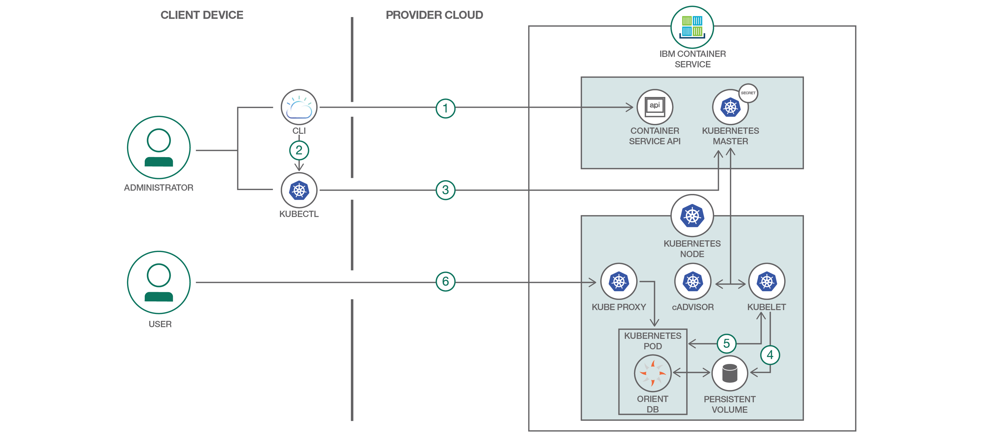
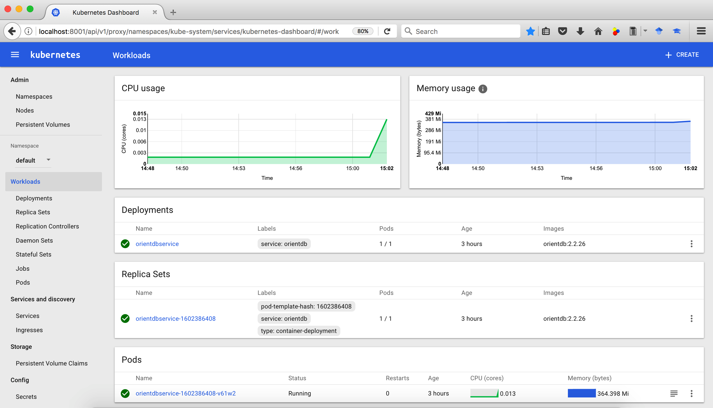
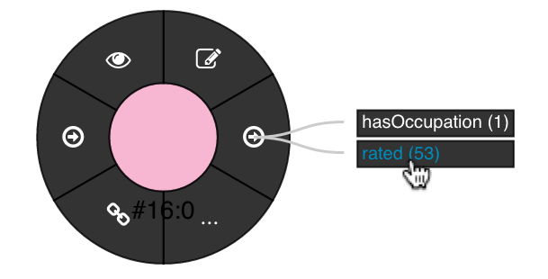

# Deploy OrientDB container on Bluemix Kubernetes

*Read this in other languages: [한국어](README-ko.md).*

[Graph databases](https://en.wikipedia.org/wiki/Graph_database), such as [OrientDB](https://github.com/orientechnologies/orientdb), store data in a graph structure consisting of nodes, edges and properties. Graph databases, by design, allow simple and fast retrieval of complex hierarchical structures in a much more efficient manner than relational databases. [Gremlin](http://tinkerpop.apache.org/gremlin.html) is a standardised graph traversal language for retrieving data from graph databases (the way SQL is for RDBMS).

In this journey we show you how to quickly deploy OrientDB on Bluemix Container Service, so that you can leverage it for your team's development and test purposes.

[IBM Bluemix Container Service](https://console.bluemix.net/docs/containers/cs_ov.html#cs_ov) combines [Docker](https://docs.docker.com/get-started/) and [Kubernetes](https://kubernetes.io/docs/concepts/overview/what-is-kubernetes/) to deliver powerful tools to automate the deployment, operation, scaling, and monitoring of containerized apps over a cluster of independent compute hosts by using the Kubernetes APIs.

This journey gives you step by step instructions for:
* Deploying OrientDB container on Bluemix Kubernetes.
* Storing the desired OrientDB password in Kubernetes secret.
* Configuring the persistent storage for OrientDB volumes by making use of Kubernetes persistent volume claim.
* Opening the deployed OrientDB's console as well as Gremlin console by making use of Kubernetes feature of getting a shell to a running container.

# Flow



1. Log in to Bluemix CLI and initialize Bluemix Container Service plugin.
2. Set context for Kubernetes CLI by downloading Bluemix Kubernetes configuration files and setting KUBECONFIG environment variable.
3. Save desired OrientDB password in Kubernetes secret.
4. Configure persistent storage for OrientDB volumes.
5. Deploy OrientDB container and NodePort service to Kubernetes cluster.
6. Access OrientDB dashboard by using the public IP address of worker node and the NodePort mapped to OrientDB's HTTP port.

## Watch the Overview Video

[](https://youtu.be/bG3xynJs0T8)

## Kubernetes Concepts Used
* [Kubernetes Pods](https://kubernetes.io/docs/concepts/workloads/pods/pod/) - Pods represent the smallest deployable units in a Kubernetes cluster and are used to group containers that must be treated as a single unit.
* [Kubernetes Deployment](https://kubernetes.io/docs/concepts/workloads/controllers/deployment/) - A deployment is a Kubernetes resource where you specify your containers and other Kubernetes resources that are required to run your app, such as persistent storage, services, or annotations.
* [Kubernetes Services](https://kubernetes.io/docs/concepts/services-networking/service/) - A Kubernetes service groups a set of pods and provides network connection to these pods for other services in the cluster without exposing the actual private IP address of each pod.
* [Kubernetes Persistent Volumes (PV)](https://kubernetes.io/docs/concepts/storage/persistent-volumes/) - PersistentVolumes are a way for users to *claim* durable storage such as NFS file storage.
* [Kubernetes Secrets](https://kubernetes.io/docs/concepts/configuration/secret/) - Objects of type *secret* are intended to hold sensitive information, such as passwords, OAuth tokens, and ssh keys.

## Included Components
* [Bluemix Container Service](https://console.ng.bluemix.net/docs/containers/cs_ov.html#cs_ov) IBM Bluemix Container Service manages highly available apps inside Docker containers and Kubernetes clusters on the IBM Cloud.
<!-- * [Bluemix Kubernetes Clusters](https://console.ng.bluemix.net/catalog/?taxonomyNavigation=apps&category=containers) - A Kubernetes cluster consists of one or more virtual machines, called worker nodes, where you can deploy, run and manage containerized apps.
* [Bluemix DevOps Toolchain Service](https://console.ng.bluemix.net/catalog/services/continuous-delivery) - Bluemix DevOps toolchains automate the building and deployment of applications. -->
* [OrientDB](https://github.com/orientechnologies/orientdb) - OrientDB is an Open Source Multi-Model NoSQL DBMS with support for Native Graphs.

## Steps
1. [Setup Bluemix Kubernetes Cluster](#step-1-setup-bluemix-kubernetes-cluster)
  - 1.1 [Install CLI for Bluemix and Kubernetes](#11-install-cli-for-bluemix-and-kubernetes)
  - 1.2 [Log in to the Bluemix CLI and initialize Bluemix Container Service plugin](#12-log-in-to-the-bluemix-cli-and-initialize-bluemix-container-service-plugin)
  - 1.3 [Create your Bluemix Kubernetes cluster](#13-create-your-bluemix-kubernetes-cluster)
  - 1.4 [Point the Kubernetes CLI to your Bluemix Kubernetes cluster](#14-point-the-kubernetes-cli-to-your-bluemix-kubernetes-cluster)
2. [Deploy OrientDB service into Kubernetes clusters](#step-2-deploy-orientdb-service-into-kubernetes-clusters)
  - 2.1 [Copy OrientDB Kubernetes configuration scripts](#21-copy-orientdb-kubernetes-configuration-scripts)
  - 2.2 [Save desired OrientDB password in Kubernetes secret](#22-save-desired-orientdb-password-in-kubernetes-secret)
  - 2.3 [Configure persistent storage for OrientDB volumes](#23-configure-persistent-storage-for-orientdb-volumes)
  - 2.4 [Deploy OrientDB into Kubernetes cluster](#24-deploy-orientdb-into-kubernetes-cluster)
  - 2.5 [View a local version of the Kubernetes dashboard](#25-view-a-local-version-of-the-kubernetes-dashboard)
  - 2.6 [Open OrientDB dashboard](#26-open-orientdb-dashboard)
3. [Import a public database and explore it using OrientDB Dashboard and Gremlin console](#step-3-import-a-public-database-and-explore-it-using-orientdb-dashboard-and-gremlin-console)
  - 3.1 [Import a public database](#31-import-a-public-database)
  - 3.2 [Explore schema and data (vertices/edges) using OrientDB dashboard](#32-explore-schema-and-data-verticesedges-using-orientdb-dashboard)
  - 3.3 [Open Gremlin/OrientDB console and run queries](#33-open-gremlinorientdb-console-and-run-queries)

[Troubleshooting](#troubleshooting)

## Step 1. Setup Bluemix Kubernetes Cluster

### 1.1 Install CLI for Bluemix and Kubernetes

Set up Bluemix and Kubernetes CLI as per instructions in https://console.bluemix.net/docs/containers/cs_tutorials.html#cs_cluster_tutorial. The steps are repeated here for quick reference.

  * Download and Install Bluemix CLI as per instructions in https://clis.ng.bluemix.net/ui/home.html. Bluemix CLI provides the command line interface to manage applications, containers, infrastructures, services and other resources in Bluemix. The prefix for running commands by using the Bluemix CLI is `bx`.

  * Install the IBM Bluemix Container Service plug-in, which allows you to create Kubernetes clusters and manage worker nodes. The prefix for running commands by using the IBM Bluemix Container Service plug-in is `bx cs`.
    ```
    $ bx plugin install container-service -r Bluemix
    ```

  * Install Kubernetes CLI. This allows you to deploy apps into your Kubernetes clusters and to view a local version of the Kubernetes dashboard. The prefix for running commands by using the Kubernetes CLI is `kubectl`.

    Instructions for installing Kubernetes CLI on macOS are given below. Please see https://kubernetes.io/docs/tasks/tools/install-kubectl/ for other methods to install `kubectl` and for instructions to install Kubernetes CLI on other platforms.
    *  Download the Kubernetes CLI
        ```
        $ curl -LO https://storage.googleapis.com/kubernetes-release/release/$(curl -s https://storage.googleapis.com/kubernetes-release/release/stable.txt)/bin/darwin/amd64/kubectl
        ```
    * Make the kubectl binary executable.
        ```
        $ chmod +x kubectl
        ```
    *  Move the binary in to your PATH.
        ```
        $ sudo mv ./kubectl /usr/local/bin/
        ```

### 1.2 Log in to the Bluemix CLI and initialize Bluemix Container Service plugin

  * Log in to the Bluemix CLI. Enter your Bluemix credentials when prompted.
    ```
    $ bx login -a api.ng.bluemix.net
    $ bx target --cf
    ```
    The API endpoint for various Bluemix regions is given below. If you have private Docker images that are stored in the container registry of a specific Bluemix region, or Bluemix services instances that you have already created, log in to this region to access your images and Bluemix services. The Bluemix region that you log in to also determines the region where you can create your Kubernetes clusters, including the available datacenters.

    - US South
        ```
        $ bx login -a api.ng.bluemix.net
        ```
    - United Kingdom
        ```
        $ bx login -a api.eu-gb.bluemix.net
        ```
    - Germany
        ```
        $ bx login -a api.eu-de.bluemix.net
        ```
    - Sydney
        ```
        $ bx login -a api.au-syd.bluemix.net
        ```

  * Initialize the IBM Bluemix Container Service plugin
    ```
    $ bx cs init
    ```
    If you want to create a Kubernetes cluster in a region other than the Bluemix region that you selected earlier, specify this region.

    - US South
      ```
      $ bx cs init --host https://us-south.containers.bluemix.net
      ```
    - UK-South
      ```
      $ bx cs init --host https://uk-south.containers.bluemix.net
      ```
    - EU-Central
      ```
      $ bx cs init --host https://eu-central.containers.bluemix.net
      ```
    - AP-South
      ```
      $ bx cs init --host https://ap-south.containers.bluemix.net
      ```

### 1.3 Create your Bluemix Kubernetes cluster

Bluemix allows you to create a free cluster that comes with 2 CPUs, 4 GB memory, and 1 worker node. This is called _lite cluster_ and allows you to get familiar with and test Kubernetes capabilities. However they lack capabilities like persistent NFS file-based storage with volumes.

To setup your cluster for maximum availability and capacity, Bluemix allows you to create a fully customizable, production-ready cluster called _standard cluster_. _Standard clusters_ allow highly available cluster configurations such as a setup with two clusters that run in different regions, each with multiple worker nodes. Please see https://console.bluemix.net/docs/containers/cs_planning.html#cs_planning_cluster_config to review other options for highly available cluster configurations.

A detailed comparison of capabilities of _lite_ and _standard_ clusters is given in https://console.bluemix.net/docs/containers/cs_planning.html#cs_planning.

  * Create your lite Kubernetes cluster.
    ```
    $ bx cs cluster-create --name mycluster
    Creating cluster...
    The machine-type flag was not specified. So a free cluster will be created
    Number of workers was not specified, using default: 1.
    OK
    ```
    Note: It can take up to 15 minutes for the worker node machine to be ordered and for the cluster to be set up and provisioned.

    In case you want to setup a standard cluster, then you can find the setup instructions in https://console.bluemix.net/docs/containers/cs_cluster.html#cs_cluster_cli.

  * Verify that the deployment of your worker node is complete.
    ```
    $ bx cs clusters
    OK
    Name        ID                                 State    Created          Workers   Datacenter   Version
    mycluster   8xxxxxxxxxxxxxxxxxxxxxxxxxxxxxxx5   normal   34 minutes ago   1         hou02        1.7.4_1503

    $ bx cs workers mycluster
    OK
    ID                                                 Public IP        Private IP     Machine Type   State    Status   Version
    kube-hou02-pxxxxxxxxxxxxxxxxxxxxxxxxxxxxxxxxx-w1   17x.xxx.xx.xxx   10.47.64.200   free           normal   Ready    1.7.4_1503
    ```

### 1.4 Point the Kubernetes CLI to your Bluemix Kubernetes cluster

Configure your Kubernetes CLI environment to point to your Bluemix Kubernetes cluster as below.

  * Download the Kubernetes configuration files and get the command to set the environment variable
    ```
    $ bx cs cluster-config mycluster
    OK
    The configuration for mycluster was downloaded successfully. Export environment variables to start using Kubernetes.

    export KUBECONFIG=/Users/zzzzz/.bluemix/plugins/container-service/clusters/mycluster/kube-config-hou02-mycluster.yml
    ```

  * Set the KUBECONFIG environment variable as per output from above command
    ```
    $ export KUBECONFIG=~/.bluemix/plugins/container-service/clusters/mycluster/kube-config-hou02-mycluster.yml
    $ echo $KUBECONFIG
    ```

  * Verify that the kubectl commands run properly with your cluster by checking the Kubernetes CLI server version.
    ```
    $ kubectl version  --short
    Client Version: v1.7.4
    Server Version: v1.7.4-1+1540c973d4ff9d
    ```

## Step 2. Deploy OrientDB service into Kubernetes clusters

### 2.1 Copy OrientDB Kubernetes configuration scripts
Clone or download the OrientDB Kubernetes configuration scripts to your user home directory.
```
$ git clone https://github.com/IBM/deploy-graph-db-container.git
```

Navigate to the source directory
```
$ cd deploy-graph-db-container
$ ls
```

### 2.2 Save desired OrientDB password in Kubernetes secret
Create a new file called password.txt in the same directory and put your desired OrientDB password inside password.txt (Could be any string with ASCII characters).

We need to make sure password.txt does not have any trailing newline. Use the following command to remove possible newlines.
```
$ tr -d '\n' <password.txt >.strippedpassword.txt && mv .strippedpassword.txt password.txt
```

Put OrientDB password in Kubernetes [secret](https://kubernetes.io/docs/concepts/configuration/secret/)
```
$ kubectl create secret generic orientdb-pass --from-file=password.txt
secret "orientdb-pass" created
```

### 2.3 Configure persistent storage for OrientDB volumes
[OrientDB docker image](https://hub.docker.com/_/orientdb/) requires following directories to be volume mounted so as to persist data across container delete/relaunch.
```
/orientdb/databases
/orientdb/backup
```

If you are using Bluemix *standard* Kubernetes cluster, then you can leverage [dynamic volume provisioning](http://blog.kubernetes.io/2016/10/dynamic-provisioning-and-storage-in-kubernetes.html) which allows storage volumes to be created on-demand. To use this feature, update the value of `volume.beta.kubernetes.io/storage-class` annotation in `orientdb.yaml` to one of the [NFS file-based storage classes supported in Bluemix](https://console.bluemix.net/docs/containers/cs_apps.html#cs_apps_volume_claim): `ibmc-file-bronze` or `ibmc-file-silver` or `ibmc-file-gold`. Also change `accessModes` to `ReadWriteMany` and increase storage request to say 20GB.
```
kind: PersistentVolumeClaim
apiVersion: v1
metadata:
  name: orientdb-pv-claim
  labels:
    service: orientdb
    type: pv-claim
  annotations:
    volume.beta.kubernetes.io/storage-class: "ibmc-file-gold"
spec:
  accessModes:
  - ReadWriteMany
  resources:
    requests:
      storage: 20Gi
  annotations:
```

In case you are using Bluemix *lite* Kubernetes cluster, where NFS file storage is not supported, you can instead use [hostPath PersistentVolume](https://kubernetes.io/docs/tasks/configure-pod-container/configure-persistent-volume-storage/#create-a-persistentvolume). A hostPath PersistentVolume uses a file or directory on the Node to emulate network-attached storage. To create a hostPath PersistentVolume, review [local-volumes.yaml](local-volumes.yaml) and run `kubectl apply` command.
```
$ cat local-volumes.yaml
apiVersion: v1
kind: PersistentVolume
metadata:
  name: "pv-volume"
  labels:
    type: local
spec:
  capacity:
    storage: "5Gi"
  accessModes:
    - "ReadWriteOnce"
  hostPath:
    path: /tmp
  persistentVolumeReclaimPolicy: Recycle
```
Create hostPath persistent volume
```
$ kubectl apply -f local-volumes.yaml
persistentvolume "pv-volume" created
```

### 2.4 Deploy OrientDB into Kubernetes cluster
Run the OrientDB Kubernetes configuration script in the cluster. When the deployment and the service are created, OrientDB is available as a service for users.
```
$ kubectl apply -f orientdb.yaml
persistentvolumeclaim "orientdb-pv-claim" created
deployment "orientdbservice" created
service "orientdbservice" created
```

The [orientdb.yaml](orientdb.yaml) script creates a Kubernetes deployment for [OrientDB container](https://hub.docker.com/_/orientdb/). The OrientDB password is fetched from the Kubernetes secret created in Step 1.2 above. Similarly the persistent volumes configured in Step 1.3 above are used as the persistent storage for OrientDB volumes. The corresponding snippet from [orientdb.yaml](orientdb.yaml) script is shown below.
```
kind: Deployment
apiVersion: extensions/v1beta1
metadata:
  name: orientdbservice
  labels:
    service: orientdb
spec:
  replicas: 1
  template:
    metadata:
      name: orientdbservice
      labels:
        service: orientdb
        type: container-deployment
    spec:
      containers:
      - name: orientdbservice
        image: orientdb:2.2.26
        env:
        - name: ORIENTDB_ROOT_PASSWORD
          valueFrom:
            secretKeyRef:
              name: orientdb-pass
              key: password.txt
        ports:
        - containerPort: 2424
          name: port-binary
        - containerPort: 2480
          name: port-http
        volumeMounts:
        - mountPath: /orientdb/databases
          name: orientdb-data
          subPath: databases
        - mountPath: /orientdb/backup
          name: orientdb-data
          subPath: backup
      volumes:
      - name: orientdb-data
        persistentVolumeClaim:
          claimName: orientdb-pv-claim
```

The [orientdb.yaml](orientdb.yaml) script also exposes OrientDB ports (HTTP: 2480 and binary: 2424) to the internet by creating a Kubernetes service of type NodePort as shown in the snippet below.
```
kind: Service
apiVersion: v1
metadata:
  name: orientdbservice
  labels:
    service: orientdb
    type: nodeport-service
spec:
  type: NodePort
  selector:
    service: orientdb
    type: container-deployment
  ports:
  - protocol: TCP
    port: 2424
    name: binary
  - protocol: TCP
    port: 2480
    name: http
```

### 2.5 View a local version of the Kubernetes dashboard.
Launch your Kubernetes dashboard with the default port 8001.
```
$ kubectl proxy
```

Open the following URL in a web browser to see the Kubernetes dashboard.
http://localhost:8001/ui


In the Workloads tab, you can see the resources that you created. When you are done exploring the Kubernetes dashboard, use CTRL+C to exit the proxy command.

### 2.6 Open OrientDB dashboard
Get information about the deployed OrientDB service to see which NodePort was assigned for OrientDB's HTTP port 2480.
```
$ kubectl describe service orientdbservice
Name:			orientdbservice
Namespace:		default
Labels:			service=orientdb
			type=nodeport-service
Annotations:		kubectl.kubernetes.io/last-applied-configuration={"apiVersion":"v1","kind":"Service","metadata":{"annotations":{},"labels":{"service":"orientdb","type":"nodeport-service"},"name":"orientdbservice","na...
Selector:		service=orientdb,type=container-deployment
Type:			NodePort
IP:			10.10.10.177
Port:			binary	2424/TCP
NodePort:		binary	32039/TCP
Endpoints:		172.xx.xxx.xx:2424
Port:			http	2480/TCP
NodePort:		http	31420/TCP
Endpoints:		172.xx.xxx.xx:2480
Session Affinity:	None
Events:			<none>
```

Get the public IP address for the worker node in the cluster.
```
$ bx cs workers mycluster
OK
ID                                                 Public IP        Private IP     Machine Type   State    Status   Version
kube-hou02-pa85736d86a8f24324806f9b83d24960e5-w1   173.xxx.xx.xxx   10.47.64.200   free           normal   Ready    1.7.4_1502
```

Open a browser and check out the OrientDB dashboard with the following URL.
```
http://<Public_IP_address>:<HTTP_NodePort>/studio/index.html#/
```


## Step 3. Import a public database and explore it using OrientDB Dashboard and Gremlin console

### 3.1 Import a public database

  * In the OrientDB dashboard, click on the cloud import button (next to *New DB*).
  * Specify username (root) and password (same as the value specified in password.txt).
  * Scroll down to *MovieRatings* database and click on download button.

    This will import a database containing Movies classified by Genre and Ratings by Users, created by MovieLens (movielens.org).

    Once import is successful, you will be taken back to login screen.

### 3.2 Explore schema and data (vertices/edges) using OrientDB dashboard

  * Log in to *MovieRatings* database
    * In the login screen of OrientDB dashboard, select *MovieRatings* under *Database* and specify username (root) and password.
    * Click *Connect*.
  * Click on Schema.
    * Under Vertex Classes, you can see following classes: `Movies, Users, Genres, Occupation`
    * Under Edge Classes, you can see following classes: `rated, hasGenera, hasOccupation`
    * Click on any of the Vertext/Edge classes, like Movies, to see its properties.
  * Click on Browse
    * Run following query:
      ```
      select from Movies
      ```
      The first 10 vertices of *Movies* class (ordered by *id*) will be shown along with its properties and, incoming and outgoing edges.
  * Click on Graph
    * Run following query:
      ```
      select from users where id = 1
      ```
    * Click on the *User* vertex at the center. In the ring that pops up, hover over outgoing edges, and click on *rated* as shown in the snapshot below.

      

      All the movies rated by this user will be shown.

    * Click on any of the movie vertices. Under *Settings*, next to *Display*, select *title*.

      This will show the movie title below each of the *Movie* vertices as shown in the snapshot below.
      

### 3.3 Open Gremlin/OrientDB console and run queries

  * Kubernetes allows us to [get a shell to a running container](https://kubernetes.io/docs/tasks/debug-application-cluster/get-shell-running-container/). We can use this feature to open [OrientDB's Gremlin console](https://orientdb.com/docs/2.2/Gremlin.html) as shown below.
    ```
    $ kubectl get pods
    NAME                               READY     STATUS    RESTARTS   AGE
    orientdbservice-2043245721-81524   1/1       Running   0          2d
    $ kubectl exec -it orientdbservice-2043245721-81524  -- /orientdb/bin/gremlin.sh

             \,,,/
             (o o)
    -----oOOo-(_)-oOOo-----
    gremlin>
    ```
    Note: Replace the name after `kubectl exec -it` with the name of the pod on which OrientDB is running as obtained by `kubectl get pods` command.

  * As an illustration, from within Gremlin console, we will connect to *MovieRatings* database and display the movies rated by a particular user (say with record id `#16:0`)
    ```
    gremlin> g = new OrientGraph("remote:localhost/MovieRatings");
    ==>orientgraph[remote:localhost/MovieRatings]
    gremlin> g.v('#16:0').outE('rated').inV().title
    ==>One Flew Over the Cuckoo's Nest (1975)
    ==>James and the Giant Peach (1996)
    ==>My Fair Lady (1964)
    ==>Erin Brockovich (2000)
    ==>Bug's Life, A (1998)
    ==>Princess Bride, The (1987)
    ==>Ben-Hur (1959)
    ==>Christmas Story, A (1983)
    ...
    gremlin> exit
    ```

  * We can similarly open OrientDB console and run [OrientDB commands](http://orientdb.com/docs/2.2.x/Console-Commands.html) as shown below.
    ```
    $ kubectl exec -it orientdbservice-2043245721-81524  -- /orientdb/bin/console.sh

    OrientDB console v.2.2.26 (build ae9fcb9c075e1d74560a336a96b57d3661234c7b) https://www.orientdb.com
    Type 'help' to display all the supported commands.
    Installing extensions for GREMLIN language v.2.6.0

    orientdb> CONNECT remote:localhost/MovieRatings root
    Enter password:

    Connecting to database [remote:localhost/MovieRatings] with user 'root'...OK
    orientdb {db=MovieRatings}> select OUT("rated").title as MovieRated from Users where id = 1 UNWIND MovieRated;

    +----+--------------------------------------+
    |#   |MovieRated                            |
    +----+--------------------------------------+
    |0   |One Flew Over the Cuckoo's Nest (1975)|
    |1   |James and the Giant Peach (1996)      |
    |2   |My Fair Lady (1964)                   |
    |3   |Erin Brockovich (2000)                |
    |4   |Bug's Life, A (1998)                  |
    |5   |Princess Bride, The (1987)            |
    |6   |Ben-Hur (1959)                        |
    |7   |Christmas Story, A (1983)             |
    |8   |Snow White and the Seven Dwarfs (1937)|
    |9   |Wizard of Oz, The (1939)              |
    |10  |Beauty and the Beast (1991)           |
    |11  |Gigi (1958)                           |
    |12  |Miracle on 34th Street (1947)         |
    |13  |Ferris Bueller's Day Off (1986)       |
    |14  |Sound of Music, The (1965)            |
    |15  |Airplane! (1980)                      |
    |16  |Tarzan (1999)                         |
    |17  |Bambi (1942)                          |
    |18  |Awakenings (1990)                     |
    |19  |Big (1988)                            |
    +----+--------------------------------------+
    LIMIT EXCEEDED: resultset contains more items not displayed (limit=20)

    20 item(s) found. Query executed in 0.013 sec(s).
    orientdb {db=MovieRatings}> quit
    $
    ```
    Note: Replace the name after `kubectl exec -it` with the name of the pod on which OrientDB is running as obtained by `kubectl get pods` command.

    The [OrientDB select query](http://orientdb.com/docs/2.2.x/SQL-Query.html) that was run above displays the movies rated by a specified user (with id = 1).

# Troubleshooting

* If you want to delete the OrientDB service from your Bluemix Kubernetes cluster, then run either of the following commands.
    ```
    $ kubectl delete -f orientdb.yaml
    ```
    OR
    ```
    $ kubectl delete deployment,services,pvc -l service=orientdb
    deployment "orientdbservice" deleted
    service "orientdbservice" deleted
    persistentvolumeclaim "orientdb-pv-claim" deleted
    ```
* If you want to delete your local persistent volume, then run either of the following commands.
    ```
    $ kubectl delete -f local-volumes.yaml
    ```
    OR
    ```
    $ kubectl delete pv -l type=local
    persistentvolume "pv-volume" deleted
    ```
* If you want to delete the Kubernetes sceret containing OrientDB password, then run the following command.
    ```
    $ kubectl delete secret orientdb-pass
    secret "orientdb-pass" deleted
    ```
* For debugging purposes, if you want to inspect the logs of OrientDB service, then run the following command.
    ```
    $ kubectl get pods # Get the name of the OrientDB pod
    $ kubectl logs [OrientDB pod name]
    ```
* If you want to delete your Bluemix Kubernetes cluster, then run the following command.
    ```
    $ bx cs cluster-rm mycluster
    Remove the cluster? [mycluster] (Y/N)> Y
    Removing cluster mycluster...
    OK
    ```

# References
* [MovieLens recommendation engine with OrientDB](http://pizzaconnections.net/2015/03/27/148/) based on Marko Rodriguez’s elegant article on [Graph-Based Movie Recommender Engine](https://markorodriguez.com/2011/09/22/a-graph-based-movie-recommender-engine/)

# License
[Apache 2.0](LICENSE)
